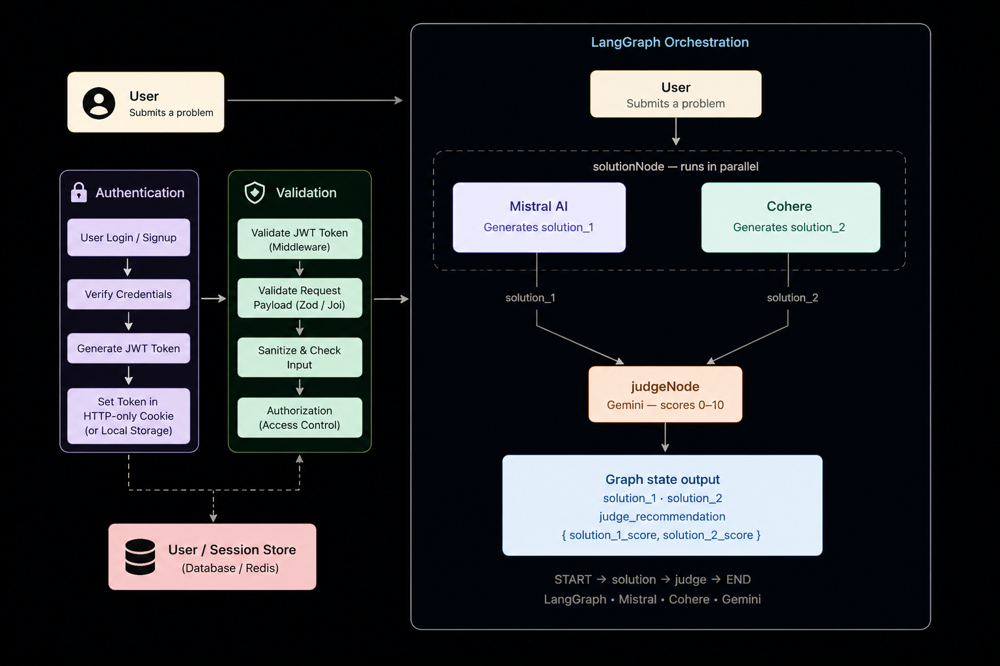

# ⚔️ DuelArena

**A multi-agent AI battle arena where language models go head-to-head — and a judge decides who wins.**

DuelArena pits two AI models (Mistral & Cohere) against any problem you throw at them. Both generate independent solutions in parallel, and a third model (Gemini) steps in as an impartial judge scoring each solution 0–10 and declaring a winner. Built on a LangGraph state machine, with a React frontend and a Node.js/Express backend.

It demonstrates how LangGraph can orchestrate multi-agent AI workflows, enabling concurrent execution, state management, and structured decision-making between multiple LLMs.

---

## ✨ What It Does

1. You submit a problem or question via the UI.
2. **Mistral** and **Cohere** each generate a solution independently, in parallel.
3. **Gemini** acts as the judge — it reads both solutions against the original problem and scores them (0–10) using structured output.
4. The arena returns the scores and both solutions side-by-side so you can compare.

---

# ⚙️ How It Works

Duel Arena follows a multi-agent workflow powered by **LangGraph**, where multiple AI models collaborate to generate, evaluate, and recommend the best response. The entire process is orchestrated as a directed graph, enabling efficient parallel execution and structured state management.

## 1. User Authentication

Before accessing the platform, users authenticate using a secure JWT-based authentication system. Protected routes ensure that only authenticated users can submit prompts and access AI comparisons.

- User logs in or signs up.
- Backend verifies credentials.
- JWT token is generated.
- Protected APIs are accessed using authenticated requests.

---

## 2. Request Validation

Every incoming request is validated before entering the AI pipeline.

Validation checks include:

- Prompt existence
- Prompt length
- Request schema
- Invalid or malicious input

This prevents unnecessary API calls and ensures consistent data is passed through the workflow.

---

## 3. LangGraph Orchestration

After validation, the request enters the **LangGraph** workflow.

LangGraph acts as the orchestration engine that manages:

- Graph state
- Node execution
- Data flow between nodes
- Parallel processing
- Workflow completion

Instead of manually coordinating multiple asynchronous API calls, each AI task is represented as a node within the graph.

---

## 4. Parallel Solution Generation

The **solutionNode** executes two independent Large Language Models simultaneously.

### 🤖 Mistral AI

Generates **Solution 1**, focusing on structured reasoning, code generation, and logical problem solving.

### 🤖 Cohere

Generates **Solution 2**, providing an alternative approach with strong natural language understanding and concise explanations.

Running both models in parallel significantly reduces response time compared to sequential execution.

---

## 5. AI Judge Evaluation

Once both responses are generated, they are passed to the **judgeNode**.

The judge uses **Gemini** to independently evaluate both solutions based on several criteria:

- Correctness
- Completeness
- Logical reasoning
- Clarity
- Readability
- Overall quality

Gemini assigns each response a score between **0 and 10**, explains its reasoning, and recommends the stronger solution.

---

## 6. Graph State Output

After evaluation, the workflow returns a structured graph state containing:

```ts
{
  solution_1,
  solution_2,
  solution_1_score,
  solution_2_score,
  judge_recommendation
}
```

The frontend displays both AI responses side by side along with their respective scores and the judge's recommendation, allowing users to compare answers and make an informed decision.


## 🧠 Tech Stack

| Layer | Technology |
|---|---|
| **AI Orchestration** | LangGraph, LangChain |
| **Models** | Mistral AI, Cohere (`command-a-reasoning`), Google Gemini |
| **Backend** | Node.js, Express, TypeScript |
| **Frontend** | React, Tailwind CSS |
| **Caching** | Redis |
| **Containerization** | Docker |
| **Code Execution** | Judge0 |

---

## 🏗️ Architecture

The core is a **LangGraph state graph** with two nodes wired in sequence:

```
START → solution → judge → END
```

## 🏗️ Architecture



```
           ┌─────────────────────────────┐
           │         solutionNode         │
           │  ┌──────────┐ ┌──────────┐  │
User ──────►  │  Mistral  │ │  Cohere  │  │  (parallel)
           │  └────┬─────┘ └────┬─────┘  │
           └───────┼────────────┼─────────┘
                   │ solution_1 │ solution_2
           ┌───────▼────────────▼─────────┐
           │          judgeNode            │
           │          (Gemini)             │
           │   scores both 0–10           │
           └──────────────────────────────┘
                         │
                   judge_recommendation
```

**State schema** tracks three things across the graph:
- `messages` — the original user prompt
- `solution_1` / `solution_2` — outputs from Mistral and Cohere
- `judge_recommendation` — Gemini's structured score object `{ solution_1_score, solution_2_score }`

---

## 🚀 Getting Started

### Prerequisites

- Node.js ≥ 18
- Docker & Docker Compose
- API keys for Mistral, Cohere, and Google Gemini

### Installation

```bash
git clone https://github.com/Div641/DuelArena.git
cd DuelArena
npm install
```

### Environment Variables

Create a `.env` file in the project root:

```env
MISTRAL_API_KEY=your_mistral_key
COHERE_API_KEY=your_cohere_key
GEMINI_API_KEY=your_gemini_key
PORT=3000
```

### Run with Docker

```bash
docker-compose up --build
```

### Run locally (without Docker)

```bash
# Start Redis separately
docker run -p 6379:6379 redis

# Start backend
npm run dev

# In another terminal, start frontend
cd client && npm install && npm run dev
```

---

## 📡 API

### `POST /arena/duel`

Submit a problem to the arena.

**Request**
```json
{
  "message": "Explain the difference between BFS and DFS, and when you'd use each."
}
```

**Response**
```json
{
  "solution_1": "Mistral's response...",
  "solution_2": "Cohere's response...",
  "judge_recommendation": {
    "solution_1_score": 8,
    "solution_2_score": 7
  }
}
```

---

## 📁 Project Structure

```
DuelArena/
├── src/
│   ├── graph/
│   │   └── arena.graph.ts      # LangGraph state machine (solution + judge nodes)
│   ├── services/
│   │   └── ai.service.ts       # Mistral, Cohere, Gemini model setup
│   ├── routes/
│   │   └── arena.routes.ts     # Express API routes
│   └── index.ts                # App entry point
├── client/
│   ├── src/
│   │   ├── components/
│   │   │   ├── Navbar.tsx
│   │   │   └── GithubIcon.tsx
│   │   └── App.tsx
│   └── package.json
├── docker-compose.yml
├── .env.example
└── README.md
```

---

## 🧩 How the Graph Works

```typescript
// Two solutions generated in parallel
const [mistralResponse, cohereResponse] = await Promise.all([
  mistralModel.invoke(state.messages),
  cohereModel.chat({ ... })
]);

// Gemini judges both with structured output
const judgeResponse = await judge.invoke({
  messages: [new HumanMessage(`
    Problem: ${problemText}
    Solution 1: ${solution_1}
    Solution 2: ${solution_2}
    Score each from 0–10.
  `)]
});
```

Gemini's response is validated with a **Zod schema** — if it doesn't return valid scores, the graph throws explicitly rather than silently defaulting to zero.

---

## 🤝 Contributing

Pull requests are welcome. For major changes, please open an issue first.

1. Fork the repo
2. Create a branch: `git checkout -b feature/your-feature`
3. Commit: `git commit -m 'feat: add your feature'`
4. Push: `git push origin feature/your-feature`
5. Open a Pull Request

---

